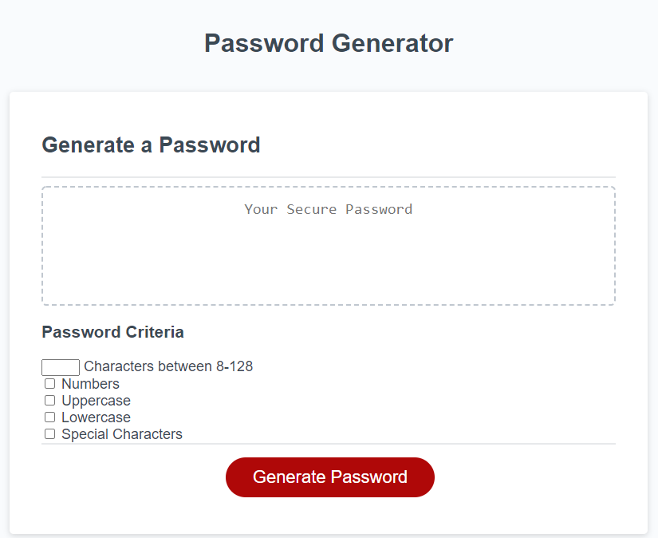
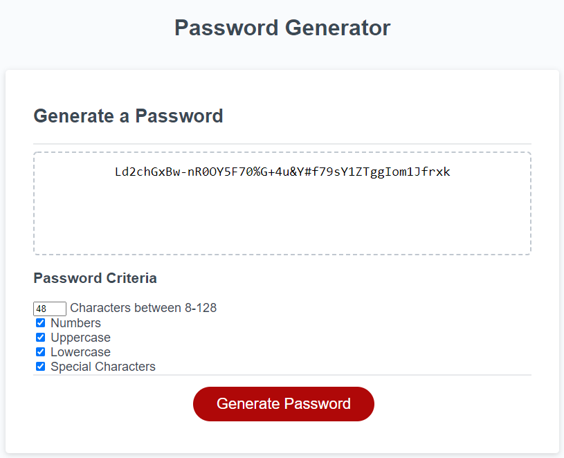
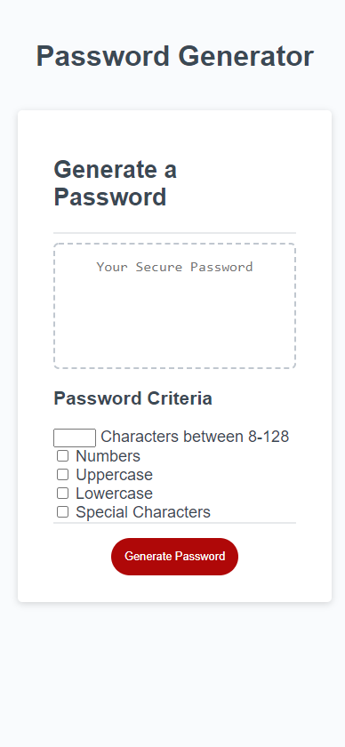

# Password Generator

This is a challenge assignment done with Georgia Tech's Full Stack Bootcamp Program

## Purpose

To be used as a means to generate strong, randomized passwords to be used as a security on websites. This page was developed so that its creator could practice making changes to the DOM using event listeners, Local Storage, and other FrontEnd JavaScript applications.

## Instructions

The user can select the different parameters he/she wants before generating the password. The parameters available are as follows:

-Number of characters (8-128)
-Numbers
-Uppercase Letters
-Lowercase Letters
-Special Characters

## Deployed Site

```bash
https://huntersteffner.github.io/Password-Generator/

```

## Selecting Criteria



## Generated Password



## Mobile Screenshot



## Contributing

This project can be cloned and referenced as inspiration in creating another portfolio webpage. Please only use as a reference.
